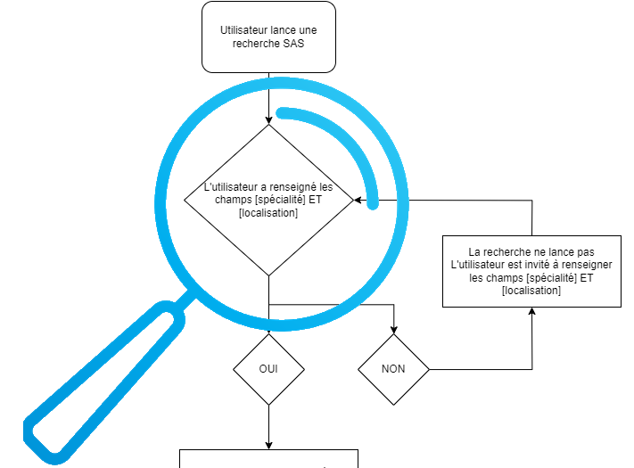

# Etape 1 - Renseignement des critères de recherche

L'utilisateur renseigne les champs [Spécialité] et [Localisation]



Accès au code source (composants Vue) :
- [{Page d'accueil}](../web/modules/custom/sas/modules/sas_vuejs/vue-core/src/components/home/HomeConnected.component.vue#L6)  
>**[Component] SearchEngine** = composant moteur de recherche  
```xml
<template>
  <div class="sas-home-wrapper-connected" :style="backgroundImage">
    <div class="hero-banner-content">
      <h1 class="sas-home-main-title" v-html="$sanitize(description)"></h1>
      <h2 v-if="subDescription" class="sas-home-main-subtitle" v-html="$sanitize(subDescription)"></h2>
      <SearchEngine />
    </div>
  </div>
</template>
```

- [{Moteur de recherche}](../web/modules/custom/sas/modules/sas_vuejs/vue-core/src/components/chargementProgressifComponents/searchComponents/SearchEngine.component.vue#L9)  
>**[Component] SearchComboboxSpeciality** = champ de sélection de la spécialité recherchée  
>**[Component] SearchComboboxLocation** = champ de sélection de la localisation recherchée  
```xml
<template>
...
      <SearchComboboxSpeciality
        ref="comboboxJob"
        :source="source"
        @confirmed-input="search"
      />

      <SearchComboboxLocation
        ref="comboboxLocation"
        :source="source"
        @confirmed-input="search"
      />
...
</template>
```

- [{Suggestion de spécialité}](../web/modules/custom/sas/modules/sas_vuejs/vue-core/src/services/searchEngine.service.js#L19)  
>**[Service] SearchEngine.getSearchSuggestionsByText()**  
```javascript
  static async getSearchSuggestionsByText(searchText, abortSignal) {
    try {
      const response = await ApiPlugin.get(
      `${SAS_SEARCH_TEXT_SUGGESTIONS}/${searchText}`,
      { signal: abortSignal },
    );
      return response && response.data;
    } catch (e) {
      if (!axios.isCancel(e)) {
        console.error('Error fetching SuggestionSearchText \n', e);
      }

      return [];
    }
  }
```

- [{Suggestion de localisation}](../web/modules/custom/sas/modules/sas_vuejs/vue-core/src/services/geolocation.service.js#L13)  
>**[Service] GeolocationService.getLocationByName()**  
```javascript
  static async getLocationByName(name, abortSignal) {
    try {
      const response = await ApiPlugin.get(
        `${SAS_API_LOCATION_AUTOCOMPLETE}?searchValue=${name}`,
        { signal: abortSignal },
      );
      return response?.data || {};
    } catch (e) {
      if (!axios.isCancel(e)) {
        console.error('Error fetching locations \n', e);
      }

      return [];
    }
  }
```

- [{Lancement de la recherche}](../web/modules/custom/sas/modules/sas_vuejs/vue-core/src/components/chargementProgressifComponents/searchComponents/SearchEngine.component.vue#L85)  
>**[Component] SearchEngine.search()**  
```javascript
    function search() {
...
      const locationQuery = `/sas/recherche?text=${encodeURIComponent(comboboxJob.value.input)}&loc=${encodeURIComponent(comboboxLocation.value.input)}`;

      const searchType = props.source === 'header' ? 'header-search-button' : 'homepage-search-button';
      SettingService
      .postSearchLog(searchType, regulatorTerritories)
      .finally(() => {
        window.location.href = locationQuery;
      });
    }
```

L'utilisateur est redirigé vers :  
```html
/sas/recherche?text=[SPECIALITE]&loc=[LOCALISATION]
```

# 
| [Retour à l'accueil](../README.md) | Page précédente | [Page suivante](step-2.md) |

