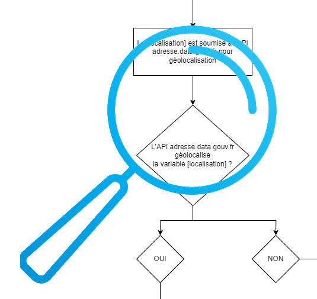

# Etape 2 - Exécution de la recherche

- [{Accès à la route de recherche}](../web/modules/custom/sas/modules/sas_search/sas_search.routing.yml#L2)  
>**[Routing] sas_search.search_page** = identifie le controller associé à la route
```yaml
sas_search.search_page:
  path: '/sas/recherche'
  defaults:
    _title: 'Page de recherche SAS'
    _controller: '\Drupal\sas_search\Controller\SasSearchController::build'
  requirements:
    _permission: 'access search'
```

- [{Requête soumise au moteur de recherche}](../web/modules/custom/sas/modules/sas_search/src/Controller/SasSearchController.php#L77)  
>**[Controller] SasSearchController** = traite les paramètres transmis à la requête  
```php
  public function build(Request $request) {
...
    $location = $this->geolocationHelper->getPlaceLocation($address);

    return [
      'content' => [
        '#type' => 'html_tag',
        '#tag' => 'div',
        '#attributes' => [
          'id' => 'sas-search-wrapper',
        ],
        '#cache' => [
          'max-age' => 3600,
          'contexts' => [
            'url.query_args:loc',
            'url.query_args:origin',
            'url.query_args:practitioner',
            'url.query_args:speciality',
            'url.query_args:streetnumber',
            'url.query_args:streetname',
            'url.query_args:inseecode',
            'url.query_args:city',
          ],
        ],
        '#attached' => [
          'library' => [
            'sas_vuejs/search-page',
          ],
          'drupalSettings' => [
            'sas_vuejs' => [
              'parameters' => [
                'location' => $location?->getObject(),
                'location_status' => !empty($location),
                'location_input' => $address ?? '',
                'maptiler_settings' => $this->entityTypeManager()->getStorage('geocoder_provider')->load('maptiler')->get('configuration'),
              ],
            ],
            'sas_environment' => $this->settings->get('sas_environment'),
          ],
        ],
      ],
    ];
  }
```  

La requête de recherche interroge dans un premier temps le service de géolocalisation (basé prioritairement sur [adresse.data.gouv.fr](https://adresse.data.gouv.fr/) et à défaut de réponse sur le service [Mapbox](https://www.mapbox.com/)).  



- [{Requête de géolocalisation}](../web/modules/custom/sas/modules/sas_geolocation/src/Service/SasGeolocationHelper.php#L39)  
>**[Service] SasGeolocationHelper.getPlaceLocation()** = récupération des coordonnées du lieu saisi  
```php
  public function getPlaceLocation(string $place): ?SasLocation {

    $geoloc_result = $this->apiManager->sas_api(
      'address_localize',
      [
        'query' => [
          'searchValue' => $place,
        ],
      ]
    );

    if (empty($geoloc_result)) {
      return NULL;
    }
    try {
      // Create and return SasLocation object.
      return SasLocation::create($geoloc_result);
    }
    catch (\Exception $exception) {
      return NULL;
    }
  }
```

L'API de géolocalisation retourne un tableau clé-valeur `$geoloc_result` contenant le détail de l'adresse, sa géolocalisation et le rayon de recherche associé (dépendant notamment du département, sa population et du nombre de professionnels de santé par habitant), qui alimente un objet de classe `SasLocation`.  
- [{Objet adresse géolocalisée}](../web/modules/custom/sas/modules/sas_geolocation/src/Model/SasLocation.php#L10)  
>**[Model] SasLocation.create()** = chargement du détail du lieu de recherche géolocalisaté dans un objet  
```php
final class SasLocation {
...
  private float $latitude;

  private float $longitude;

  private float $defaultRadius;
...
  public static function create(array $data): SasLocation {
    $location = new self();
    foreach ($data as $name => $value) {
      $location->$name = $value;
    }
    return $location;
  }
...
}
```  

La requête de recherche fournit l'ensemble du contexte à l'application VueJS `sas_vuejs/search-page` en charge d'interroger les services permettant de déterminer les prochaines disponibilités des professionnels de santé.  
- [{Application de chargement progressif du résultat}](../web/modules/custom/sas/modules/sas_vuejs/vue-core/src/modules/search-module)  
>**[Module] main.js** = instanciation de l'application VueJS  
>**[Module] App.vue** = template de l'application VueJS  

```vue
<template>
  <ChargementProgressif />
</template>

<script>
import ChargementProgressif from '@/pages/chargement-progressif/Search.page.vue';

export default {
  name: 'App',
  components: {
    ChargementProgressif,
  },
};
</script>
```

# 
| [Retour à l'accueil](../README.md) | [Page précédente](step-1.md) | [Page suivante](step-3.md) |
