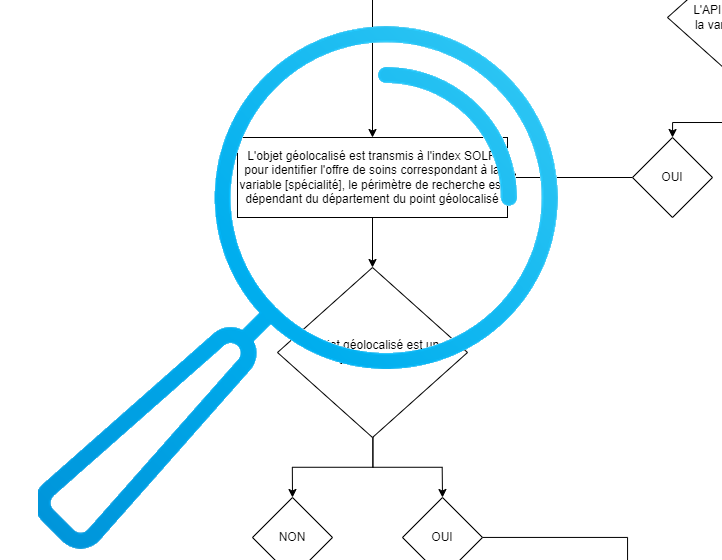
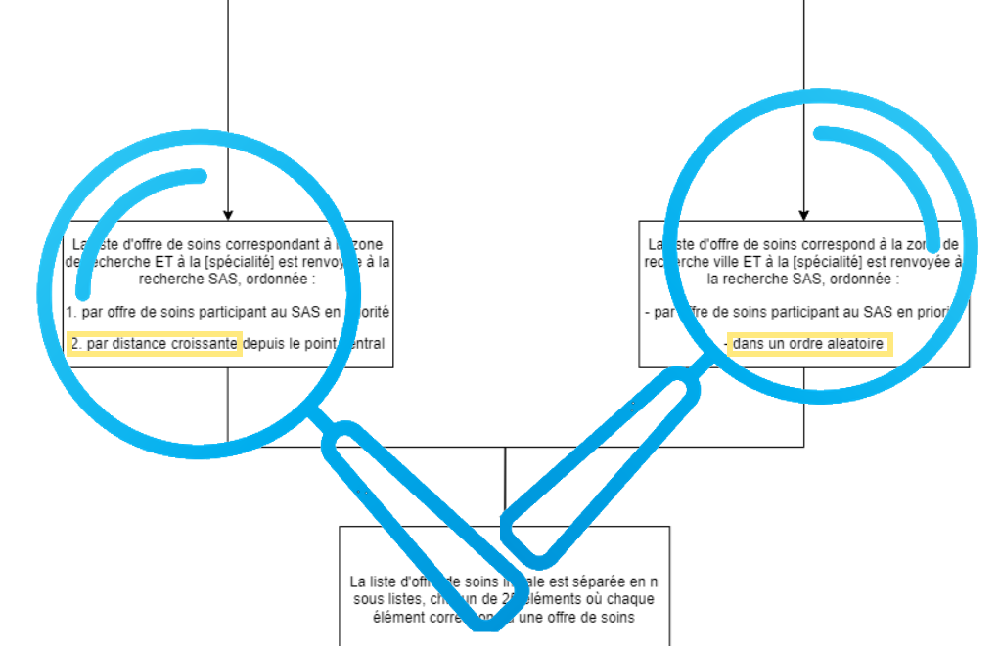
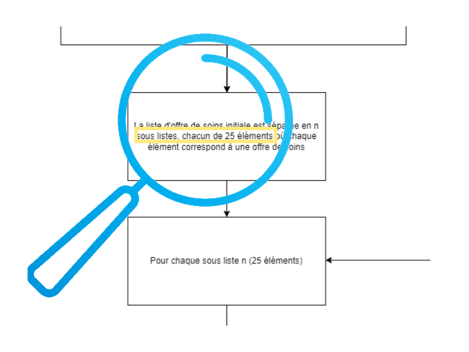

# Etape 3a - Récupération de l'offre de soins selon géolocalisation

Après initialisation et à partir du périmètre de recherche issu de la géolocalisation (point central et rayon), l'offre de soins associée à la spécialité est extraite de l'index du référentiel national.
- [{Chargement progressif - Offre de soins}](../web/modules/custom/sas/modules/sas_vuejs/vue-core/src/pages/chargement-progressif/Search.page.vue#L298)  
>**[Page] fetchBatchSolr()** = récupère la liste des professionnels de santé correspondant la spécialité dans le périmètre de recherche
```javascript
    async function fetchBatchSolr(customFilterSearch = false) {
...
      // isFirstLoad
      promiseSearch.push(getSOLRresults(false));
...
    }
```



La requête au moteur d'indexation :
- [{Offre de soins - Composition requête}](../web/modules/custom/sas/modules/sas_vuejs/vue-core/src/composables/useSearchApiCalls.composable.js#L24)
>**[Composable] useSearchApi.getSOLRresults()** = récupère la liste des professionnels de santé correspondant la spécialité dans le périmètre de recherche, construit le payload et applique les filtres
```javascript
  async function getSOLRresults(filtered = true) {
...
    const payloadSettings = {
      text: lrmDataStore.speciality,
      location: geolocationStore.geolocation,
      isLrmSearchWithPreferredDoctor:
        lrmDataStore.isLrmSearchWithPreferredDoctor,
      prefDoctor: filtered ? lrmDataStore.prefDoctorParam : null,
      hasSlot: filtered,
    };
...
    const searchPayload = createSearchPayload({
      filters: { ...searchDataStore.customFilters },
      paginationData: currentPaginationData,
      settings: payloadSettings,
    });

    const res = await SearchService.getSearchResults(searchPayload);
...
    return res;
  }
```

Le payload de la requête est construit à partir des paramètres `payloadSettings` et des éventuels filtres actifs `customFilters` ainsi que du curseur de pagination `currentPaginationData`.  
A noter le tri appliqué en fonction de la nature de la géolocalisation : 
- `distance` si la géolocalisation est obtanue à partir d'une adresse
- `random` dans tous les autres cas dont département, code postal (utilisation du [mode random de tri de Solr](https://solr.apache.org/docs/8_11_1/solr-core/org/apache/solr/schema/RandomSortField.html)).  



La construction du payload :
- [{Offre de soins - Payload}](../web/modules/custom/sas/modules/sas_vuejs/vue-core/src/composables/usePayload.composable.js#L20)
>**[Model] PayloadClass.createSearchPayload()** = construit le payload et applique les filtres
```javascript
  /**
   * Creation of the solr search payload
   * @param {object} _ - contains the ids of filters checked by user
   * @param {Array} _.filters - contains the ids of filters checked by user
   */
  const createSearchPayload = ({ filters, paginationData, settings = {} }) => {
    const payloadTemp = new PayloadModel();
...
    if (settings.location) {
      payloadTemp.center_lat = settings.location.latitude;
      payloadTemp.center_lon = settings.location.longitude;
      payloadTemp.radius = settings.location.radius ?? settings.location.defaultRadius;
      payloadTemp.sort = settings.location.type === 'address' ? 'distance' : 'random';
    }
...
    if (filters) payloadTemp.filters = filters;

    return payloadTemp.computeQuery();
  };
```

La requête Solr est issue de la transformation du payload.
- [{Offre de soins - Requête Solr}](../web/modules/custom/sas/modules/sas_vuejs/vue-core/src/models/filters/Payload.model.js#L2)
>**[Model] PayloadClass.getQuery()** = transforme le payload en requête Solr
```javascript
export default class PayloadClass {
  computeQuery() {
    let query = '';

    query += Object.keys(this).map((key) => `${key}=${key === 'filters' ? JSON.stringify(this[key]) : this[key]}`).join('&');

    return query;
  }
}
```

- [{Offre de soins - Appel API index Solr}](../web/modules/custom/sas/modules/sas_vuejs/vue-core/src/services/search.service.js#L28)
>**[Service] SearchService.getSearchResults()** = récupère la liste des professionnels de santé correspondant la spécialité dans le périmètre de recherche
```javascript
  static async getSearchResults(payload, baseUrl = SAS_SOLR) {
    // have to remove all quotations marks added by the payload model
    const currentParams = decodeURI(new URLSearchParams(payload).toString());

    try {
      const result = await ApiPlugin.get(`${baseUrl}?${currentParams}`);
      return result?.data;
    } catch (e) {
      console.error('Error fetching getResults \n', e);
      return { error: 'Error fetching getResults' };
    }
  }
``` 

La requête retourne un tableau avec des éléments de signalétiques des professionnels de santé, dont :
- rpps :  identifiant RPPS du PS
- rpps_rang
- adeli : identifiant ADELI du PS
- finess : identifiant FINESS du PS
- siret : identifiant SIRET du PS
- cp : code postal du lieu d'exercice
- address : adresse du lieu d'exercice
- phone : téléphone du lieu d'exercice
- latitude : latitude du lieu d'exercice
- longitude : longitude du lieu d'exercice

La liste des professionnels de santé retournée par le moteur d'index est ensuite découpée en lots de 25 items (professionnels de santé), qui sont soumis à l'API SAS et à l'agrégateur pour les professionnels ayant déclaré leur solution de prise de rendez-vous. 
L'objectif est de récupérer un ensemble de 5 cartes par page ayant des créneaux disponibles. 



# 
| [Retour à l'accueil](../README.md) | [Page précédente](step-2.md) | [Page suivante](step-3b.md) |