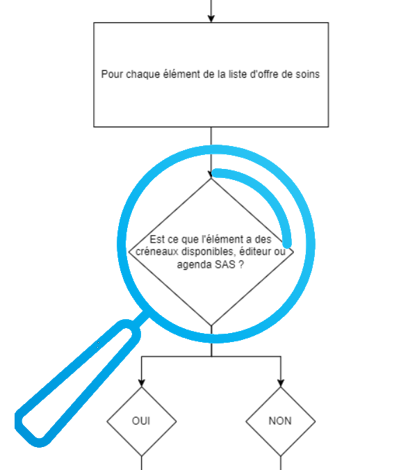
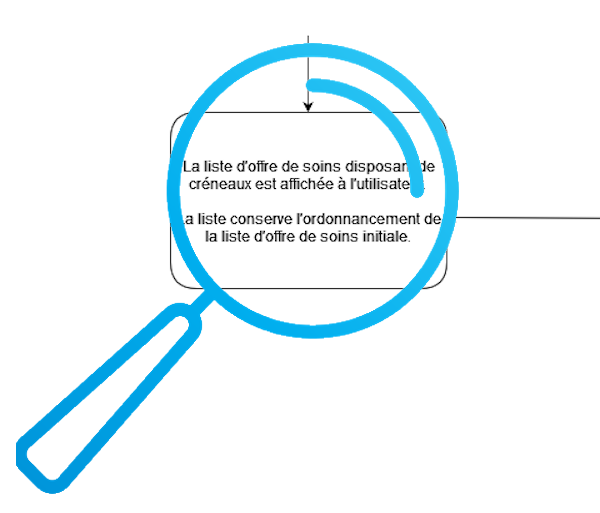
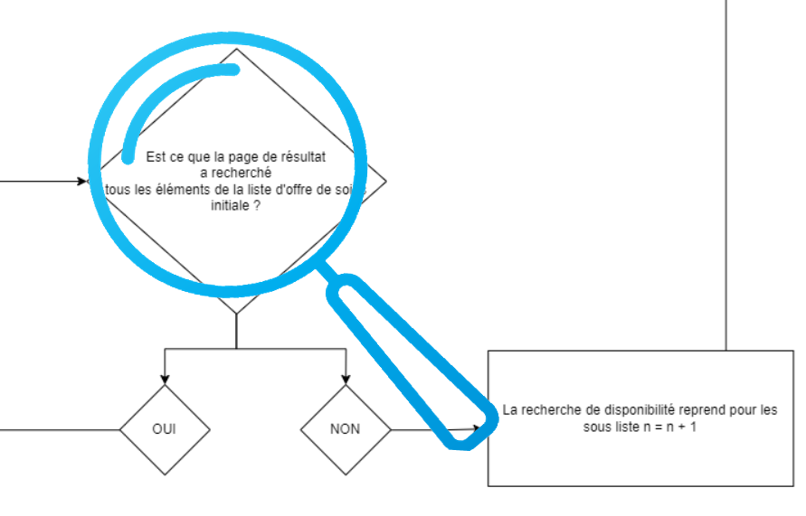

# Etape 3b - Récupération des disponibilités selon géolocalisation

Après récupération de la liste des professionnels de santé selon géolocalisation, celle-ci sert à interroger -par lots de 25 items- les logiciels de prise de rendez-vous et l'agenda SAS (pour les PS ne disposant pas d'une solution interfacée) pour déterminer les créneaux disponibles.



- [{Chargement progressif - Disponibilités}](../web/modules/custom/sas/modules/sas_vuejs/vue-core/src/pages/chargement-progressif/Search.page.vue#L353)  
>**[Page] fetchBatchApi()** = récupère la liste des disponibilités correspondant aux professionnels de santé dans le périmètre de recherche
```javascript
    /**
     * fetch data from SOLR with given filters
     */
    async function fetchBatchSolr(customFilterSearch = false) {
      const promiseSearch = [];
      let unfilteredSolr = {};
...
      await fetchBatchApi();

      nextTick(async () => {
        await setSearchEndStatus(searchDataStore.isFiltered ? solrRes : unfilteredSolr);
      });
    }
```

```javascript
    /**
     * Launch sas api && agreg to get at least 5 cards
     */
    async function fetchBatchApi() {
      // set aggregator token
      if (!cookie.getCookie('sas_aggregator_token')) {
        await SettingService.getAggregatorToken();
      }

      if (
        solrSlicedRes.value[currentSolrArraySliceWithSlots.value]
      ) {
        const results = await getApiResults(solrSlicedRes.value[currentSolrArraySliceWithSlots.value]);
        const resultsWithSlots = results.filter((res) => (
          res.slotList
          && (
            res.slotList.today.length > 0
            || res.slotList.tomorrow.length > 0
            || res.slotList.afterTomorrow.length > 0
          )
        ));
        searchDataStore.setAllResults(resultsWithSlots, true);
        currentSolrArraySliceWithSlots.value += 1;

        if (shouldGetMoreResults.value) {
          await fetchBatchApi();
        }

        if (!solrSlicedRes.value[currentSolrArraySliceWithSlots.value]) {
          currentSolrArraySliceWithSlots.value = 1;
          solrSlicedRes.value = {};
        }
      }
    }
```

A partir des données paginées de l'offre de soins, l'appel aux APIs agrégateur et calendrier SAS récupère la liste des disponibilités sur la journée courante `today`, le lendemain `tomorrow` et le surlendemain `afterTomorrow`.


La requête aux APIs agrégateur et calendrier SAS :
- [{Disponibilités - Composition requête}](../web/modules/custom/sas/modules/sas_vuejs/vue-core/src/composables/useSearchApiCalls.composable.js#L83)
>**[Composable] useSearchApi.getApiResults()** = récupère la liste des créneaux disponibles pour le lot courant de professionnels de santé
```javascript
  /**
   * Call sas-api & aggregator & fetch results
   * @param {*} solrArray
   * @param {*} isFiltered
   * @returns
   */
  async function getApiResults(solrArray, isFiltered = true) {
    const allPromises = [];
...
    const sasApiPayload = createSasApiPayload(solrArray);
    allPromises.push(
      SearchService.getSasResults(
        sasApiPayload,
        startDate,
        endDate,
      ),
    );
...
      const withEditorEnabled = solrArray.filter(
        (res) => !res.bs_sas_editor_disabled,
      );

      if (withEditorEnabled.length) {
        const aggregatorPayload = createAggregatorPayload(
          withEditorEnabled,
          isFiltered,
          departments,
        );

        allPromises.push(SearchService.getAggregatorResults(aggregatorPayload));
      }
    }

    const allResults = await Promise.all(allPromises);

    const sasApiRes = allResults[0] || {};
    const agregApiRes = allResults[1] || {};

    return new SearchModel(
      solrArray,
      agregApiRes || {},
      sasApiRes || {},
      {},
      {},
    ).getSearchResultsData();
  }
```

Le payload de la requête à l'API calendrier SAS est construit à partir de la liste des professionnels de santé et des dates de début/fin de période :
- [{Disponibilités - Construction payload API SAS}](../web/modules/custom/sas/modules/sas_vuejs/vue-core/src/composables/usePayload.composable.js#L79)
>**[Composable] usePayload.createSasApiPayload()** = construit la liste des professionnels de santé non interfacés du lot courant avec leurs éléments de signalétique `results`
```javascript
  /**
   * Creation of the sas api availabilities payload
   * @param {Array} results - contains the list of the results
   */
  const createSasApiPayload = (results) => {
    const sasApiPayload = [];
    results.forEach((card) => {
      sasApiPayload.push({
        nid: card.its_nid || '',
        rpps: card.ss_field_identifiant_rpps || '',
        adeli: card.ss_field_personne_adeli_num || '',
        finess: card.ss_field_identifiant_str_finess || card.ss_field_identifiant_finess || '',
        siret: card.ss_field_identif_siret || '',
        rpps_rang: card.ss_field_identifiant_active_rpps || '',
        cp: card.ss_field_codepostal || '',
        guid: card.ss_field_identifiant || '',
      });
    });
    return sasApiPayload;
  };
```

Les résultats sont obtenus par l'appel de l'API calendrier SAS pour le payload précédemment construit fourni en entrée et dates de début et fin de période :
- [{Disponibilités - Appel API SAS}](../web/modules/custom/sas/modules/sas_vuejs/vue-core/src/services/search.service.js#L71)
>**[Service] SearchService.getSasResults()** = récupère la liste des créneaux disponibles auprès du calendrier SAS pour le lot courant de professionnels de santé non interfacés
```javascript
  static async getSasResults(sasApiPayload, start, end) {
    try {
      const res = await ApiPlugin.post(
        `${SAS_JSON_API}/get-slots-by-ps`,
        sasApiPayload,
        {
          params: {
            start_date: start,
            end_date: end,
          },
        },
      );
      return res?.data || null;
    } catch (e) {
      console.error('Error fetching getAvailabilitiesResults \n', e);
      return {};
    }
  }
```

Le payload de la requête à l'API agrégateur est construit à partir de la liste des professionnels de santé :
- [{Disponibilités - Construction payload agrégateur}](../web/modules/custom/sas/modules/sas_vuejs/vue-core/src/composables/usePayload.composable.js#L102)
>**[Composable] usePayload.createAggregatorPayload()** = construit la liste des professionnels de santé interfacés du lot courant avec leurs éléments de signalétique `results`
```javascript
  /**
   * Creation of the aggregator payload
   * @param {Array} results - contains the list of the results
   * @param {Boolean} isFiltered - if the filter custom availabilty is checked
   * @param {Object} departments - contains the departmenent of the search result
   */
  const createAggregatorPayload = (results, isFiltered, departments) => {
    const searchType = isFiltered ? 'filtered' : 'not filtered';
    const aggregatorPayload = [];

    aggregatorPayload.push({
      search_parameter: {
        search_zone: departments.county_code,
        county_ids: departments.county_list,
        'search-type': searchType,
      },
    });

    results.forEach((card) => {
      const currentPsInfo = {};
      if (card.its_nid) {
        const geoLocSplit = (card.locs_field_geolocalisation_latlon || '').split(',');

        currentPsInfo[card.its_nid] = {
          rpps: card.ss_field_identifiant_rpps || '',
          adeli: card.ss_field_personne_adeli_num || '',
          finess: card.ss_field_identifiant_finess || card.ss_field_identifiant_str_finess || '',
          siret: card.ss_field_identif_siret || '',
          rpps_rang: card.ss_field_identifiant_active_rpps || '',
          cp: card.ss_field_codepostal || '',
          address: card.ss_field_street,
          phone: card.tm_X3b_und_field_phone_number || card.tm_X3b_und_telephones || card.tm_X3b_und_etb_telephones || [''],
          latitude: geoLocSplit[0] || '',
          longitude: geoLocSplit[1] || '',
        };

        aggregatorPayload.push(currentPsInfo);
      }
    });

    return aggregatorPayload;
  };
```

A noter que l'appel agrégateur est uniquement effectué si au moins un professionnel de santé de la liste courante est interfacé. Les solutions interfacées retournent les créneaux disponibles pour le jour courant, le lendemain et le surlendemain.

Les résultats sont obtenus par l'appel de l'API agrégateur pour le payload précédemment construit fourni en entrée :
- [{Disponibilités - Appel API agrégateur}](../web/modules/custom/sas/modules/sas_vuejs/vue-core/src/services/search.service.js#L35)
>**[Service] SearchService.getAggregatorResults()** = récupère la liste des créneaux disponibles auprès des solutions interfacées pour le lot courant de professionnels de santé
```javascript
  static async getAggregatorResults(payload) {
    try {
      const res = await ApiPlugin.post(
        SAS_AGGREGATOR,
        payload,
        {
          headers: {
            Authorization: `bearer ${ cookie.getCookie('sas_aggregator_token')}`,
          },
        },
      );
      return res.data || null;
    } catch (e) {
      console.error('Error fetching getAggregatorResults \n', e);
      return {};
    }
  }
```

Les créneaux sont ensuite consolidés pour être affichés et/ou complétés de façon à constituer 5 cartes par page et charger les pages suivantes en tâche de fond selon la navigation.

- [{Disponibilités - Résultats APIs}](../web/modules/custom/sas/modules/sas_vuejs/vue-core/src/composables/useSearchApiCalls.composable.js#L83)
>**[Composable] useSearchApi.getApiResults()** = récupère la liste des créneaux disponibles pour le lot courant de professionnels de santé
```javascript
  /**
   * Call sas-api & aggregator & fetch results
   * @param {*} solrArray
   * @param {*} isFiltered
   * @returns
   */
  async function getApiResults(solrArray, isFiltered = true) {
...
    const sasApiRes = allResults[0] || {};
    const agregApiRes = allResults[1] || {};

    return new SearchModel(
      solrArray,
      agregApiRes || {},
      sasApiRes || {},
      {},
      {},
    ).getSearchResultsData();
  }
```

- [{Disponibilités - Données retournées}](../web/modules/custom/sas/modules/sas_vuejs/vue-core/src/models/search/Search.model.js#L30)
>**[Model] SearchClass.getSearchResultsData()** = consolide la liste des créneaux disponibles pour les afficher sur les cartes des professionnels de santé
```javascript
  getSearchResultsData() {
    let result = [];

    this.searchRequestRes.forEach((card) => {
      if (card.its_nid) {
        // Every card could have multiple action returned from the api
        const cardAggregatorItems = [];

        // Variable to check if the aggregator is enabled in the back office
        let aggregatorEnabled = false;
        if (!card.bs_sas_editor_disabled) {
          aggregatorEnabled = true;
        }

        // if aggregator enabled, get all aggregator items for the card
        if (aggregatorEnabled) {
          Object.entries(this.aggregRes).forEach(([key, aggregItem]) => {
            if (key.toString() === card.its_nid.toString()) {
              cardAggregatorItems.push(aggregItem);
            } else if (aggregItem.nid && aggregItem.nid.toString() === card.its_nid.toString() && aggregItem.action === 'create') {
               // Random integer id is for the actions create because of the event with the map (on hover on the card and click on the marker)
              cardAggregatorItems.push({
                ...aggregItem,
                its_nid: Math.floor(100000 + Math.random() * 900000),
              });
            }
          });
        }

        const sasItem = this.sasRes[card.its_nid] || {};
        if (cardAggregatorItems.length > 0) {
          cardAggregatorItems.forEach((aggregatorItem) => {
            if (aggregatorItem.action !== 'delete') {
              result.push(this.#resolveCardSlots(card, aggregatorItem, sasItem));
            }
          });
        } else {
          result.push(this.#resolveCardSlots(card, {}, sasItem));
        }
      }
    });

    result = this.sortCards(result);

    return result;
  }
```

Où l'affectation des créneaux retournés par l'agrégateur `aggregRes` ou le calendrier SAS `sasRes` aux cartes est réalisée en parcourant `searchRequestRes`, liste des professionnels de santé pour lesquels la disponibilité a été requêtée.
Pour chaque item, la carte est finalement produite par la méthode `#resolveCardSlots()` :

>**[Model] SearchClass.#resolveCardSlots()** = construit la carte à afficher pour un professionnel de santé et ses créneaux disponibles
```javascript
  #resolveCardSlots(card, aggregItem, sasItem) {
    let newCard = {};
    // Get aggregator action
    const aggregAction = aggregItem.action || '';
    const isAggreg = aggregAction === 'create' || aggregAction === 'update';

    // Get slots items from aggregtor or sas api
    const slots = isAggreg ? aggregItem : sasItem;
...
    newCard = {
      ...card,
      final_phone_number: finalPhoneNumber,
      isSOSMedecin: isPfg,
      scheduleData,
      ...slotsListAndTable,
      ...agregFields.configFields,
      sasParticipationLabel,
      sasForfaitReuLabel,
      finalAddress,
      defaultPicto: cardIcon,
      cardTitle: cardTitles.title,
      cardSubTitle: cardTitles.subtitle,
      calculatedTimeZone: slotTz,
      agregSpecialities: agregFields.skillsEditor,
      isCPTS,
      isMSP: card.its_sas_participation_via === 3,
    };
...
    return newCard;
  }
```



Il est important de noter que si un premier tri est réalisé lors de la récupération de l'offre de soins, liste des professionnels de la spécialité selon la nature de la géolocalisation (voir [step-3a.md](ici)), un nouveau tri est réalisé à ce stade pour proposer en priorité les créneaux disponibles dans le délai le plus court :
- [{Disponibilités - Données retournées}](../web/modules/custom/sas/modules/sas_vuejs/vue-core/src/models/search/Search.model.js#L30)
>**[Model] SearchClass.getSearchResultsData()** = consolide la liste des créneaux disponibles pour les afficher sur les cartes des professionnels de santé
```javascript
  getSearchResultsData() {
    let result = [];
...
    result = this.sortCards(result);

    return result;
  }
```

>**[Model] SearchClass.sortCards()** = tri les cartes des professionnels de santé pour présenter les créneaux à disponibilité la plus proche dans le temps
```javascript
  /**
   * Order by the cards list
   */
   sortCards(list) {
    const lrmList = this.sortCardsByFirstSlot(list.filter((x) => x.isLrmSearchWithPreferredDoctor));
    const searchList = this.sortCardsByFirstSlot(list.filter((x) => !x.isLrmSearchWithPreferredDoctor));

    return lrmList.concat(searchList);
  }
```

>**[Model] SearchClass.sortCardsByFirstSlot()** = tri les cartes pour présenter les créneaux à disponibilité la plus proche en priorisant selon le scénario le médecin traitant (LRM), les participants au SAS, le reste de l'offre de soins
```javascript
  /**
   * Order by the cards by the first available slot && sas participation
   * Niveau 1 : LRM
   * Niveau 2 : Par participation au SAS par disponibilité
   * Niveau 3 : reste de l'offre de soins par disponibilité
   */
  sortCardsByFirstSlot = (cards) => {
    const cardsWithSlots = cards.filter((card) => (
      card.slotList
      && (
        card.slotList.today?.length
        || card.slotList.tomorrow?.length
        || card.slotList.afterTomorrow?.length
      )
    ));

    const cardsWithoutSlots = cards.filter((card) => (
      card.slotList
      && (
        card.slotList.today?.length === 0
        && card.slotList.tomorrow?.length === 0
        && card.slotList.afterTomorrow?.length === 0
      )
    ));

    // sort by slot && with sas participation
    const cardsWithSasParticipation = cardsWithSlots.filter((card) => card.bs_sas_participation).sort(this.#sortCardsBySlot);
    // sort by slot && without sas participation
    const cardsWithoutSasParticipation = cardsWithSlots.filter((card) => !card.bs_sas_participation).sort(this.#sortCardsBySlot);

    // sort with sas participation
    const cardsNoSlotsWithSasParticipation = cardsWithoutSlots.filter((card) => card.bs_sas_participation);
    // sort without sas participation
    const cardsNoSlotsWithoutSasParticipation = cardsWithoutSlots.filter((card) => !card.bs_sas_participation);

    return cardsWithSasParticipation.concat(cardsWithoutSasParticipation, cardsNoSlotsWithSasParticipation, cardsNoSlotsWithoutSasParticipation);
  };
```

S'agissant d'une recherche progressive, la chronologie des requêtes décrite dans ce chapitre est répétée jusqu'à avoir récupéré suffisamment de disponibilités pour compléter l'affichage de la page, en considérant un nouveau lot de 25 professionnels de santé issus de la requête auprès du référentiel national avec application du filtre par spécialité et géolocalisation.
Les pages suivantes sont pré-chargées en tâches de fond afin de fluidifier la navigation des utilisateurs.



# 
| [Retour à l'accueil](../README.md) | [Page précédente](step-3a.md) | Page suivante |